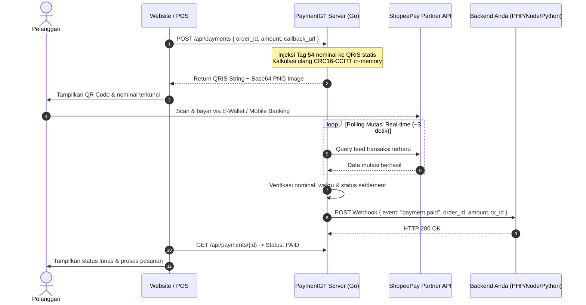

<div align="center">

# PaymentGT

**High-Performance Self-Hosted QRIS Dynamic Gateway & Settlement Daemon**

Developed by **Fajrin Widianto (Zeff)** ([@fajrinTech](https://github.com/fajrinTech))

[](https://golang.org)
[](LICENSE)
[](#)
[](#)

*Ubah QRIS Statis outlet merchant ShopeePay menjadi QRIS Dinamis instan dengan nominal pas (tanpa kode unik receh), settlement otomatis real-time, dan webhook HTTP ke backend Anda.*

</div>

---

> [!IMPORTANT]
> ### Penafian Penting (Disclaimer)
>
> Proyek **PaymentGT** adalah perangkat lunak independen (*unofficial*) yang dikembangkan untuk tujuan riset teknis, otomasi merchant mandiri (*self-hosted*), dan studi integrasi sistem pembayaran.
>
> * **Bukan Layanan Resmi**: Proyek ini **TIDAK berafiliasi, TIDAK didukung, dan TIDAK terkait secara resmi dengan PT Shopee International Indonesia, Sea Group, PT GoTo Gojek Tokopedia Tbk, atau afiliasinya**.
> * **Hak Kekayaan Intelektual**: Semua nama merek, logo, dan merek dagang seperti Shopee, ShopeePay, Gojek, GoPay, dan QRIS adalah hak milik mutlak dari pemilik resminya masing-masing.
> * **Tanggung Jawab Penggunaan**: Penggunaan software ini sepenuhnya merupakan tanggung jawab pengguna sebagai pemilik akun merchant. Pengguna wajib mematuhi seluruh Syarat dan Ketentuan layanan merchant yang berlaku. Pengembang tidak bertanggung jawab atas segala bentuk sanksi, penangguhan akun, atau kerugian operasional yang timbul akibat penggunaan software ini.

---

## Mengapa PaymentGT?

Banyak pemilik usaha online dan UMKM terbebani potongan fee per transaksi yang tinggi dari aggregator payment gateway komersial. Di sisi lain, menggunakan QRIS statis biasa mengharuskan pembeli mengetik sendiri nominal pembayaran, sehingga rawan salah transfer, salah ketik, atau kecurangan bukti transfer palsu.

**PaymentGT** hadir sebagai solusi mandiri (self-hosted) berkinerja tinggi:

1. **Nominal Pas 100% (Strictly Exact Amount)**: Tagihan terkunci persis sesuai nominal produk (misal Rp 50.000 tetap Rp 50.000 murni tanpa tambahan kode unik), atau gunakan mode alokasi unik jika diperlukan.
2. **Solusi Anti-Kadaluwarsa ShopeePay (Universal Scanner Compatibility)**: Menggunakan teknik injeksi EMVCo Hybrid (Tag 01 = 11 + Tag 54). Menghilangkan bug klasik *"Kode QR Kadaluwarsa"* pada scanner aplikasi ShopeePay, sekaligus tetap mengunci nominal otomatis pada BCA, Mandiri, BRI, BNI, GoPay, Dana, OVO, LinkAja, dan seluruh m-banking di Indonesia.
3. **Settlement Real-time**: Daemon memonitor mutasi transaksi masuk langsung dari API ShopeePay Partner/Merchant secara otomatis.
4. **Notifikasi Webhook Andal**: Mengirim HTTP POST ke server backend Anda secara instan saat dana terkonfirmasi, dilengkapi mekanisme retry otomatis hingga 3 kali.
5. **Ultra Ringan & Hemat Resource**: Ditulis dalam Go murni. Konsumsi RAM hanya ~15 sampai 25 MB dengan latensi respon REST API di bawah 5ms. Sangat hemat dan stabil dijalankan di VPS termurah ($1 - $2/bulan) maupun server pribadi rumahan.
6. **Keamanan 100% Terbuka**: Tanpa script obfuscated, tanpa backdoor, tanpa pengiriman kredensial ke server pihak ketiga. Seluruh kode sumber dapat Anda audit sepenuhnya.

---

## Fleksibilitas & Keamanan Deployment

### Bisa Dijalankan di Mana Saja
* **Server Pribadi (Home Server / Local PC / Mini PC)**: Dapat dijalankan langsung di komputer pribadi, laptop kantor, server rumahan, atau mini PC (seperti Raspberry Pi) dengan sistem operasi Windows, Linux, maupun macOS. Anda tidak wajib menyewa VPS bila memiliki server lokal yang terhubung ke jaringan.
* **VPS (Virtual Private Server)**: Berjalan mulus di VPS Linux berspesifikasi paling minim sekalipun (RAM 512 MB, 1 vCPU) seperti paket $1 sampai $2/bulan di DigitalOcean, Linode, Contabo, AWS Lightsail, Biznet Gio, IDCloudHost, atau penyedia lokal lainnya.
* **Dedicated Server & Container**: Sangat cocok dijadikan microservice internal pada arsitektur Docker / Kubernetes maupun dijalankan sebagai daemon Systemd latar belakang (background service) selama 24/7 tanpa henti.

### Terjamin Aman Digunakan (100% Private & Self-Hosted)
* **Dana Langsung ke Rekening Anda (Zero Middleman)**: Seluruh pembayaran dari pembeli masuk 100% langsung ke saldo merchant ShopeePay Anda sendiri tanpa perantara. Tidak ada sistem deposit pihak ketiga, tidak ada masa penahanan dana (*hold/escrow*), dan tidak ada potongan fee persentase per transaksi dari gateway.
* **Kerahasiaan Kredensial 100% Terjaga**: File konfigurasi sesi (`session.json`) dan token otorisasi merchant hanya berada di mesin Anda sendiri. Daemon PaymentGT tidak pernah mengirim kredensial, cookie, atau data transaksi ke server eksternal selain endpoint resmi merchant Shopee.
* **Kode Sumber Transparan**: Tidak ada kode yang dienkripsi (tanpa enkripsi IonCube, tanpa biner tertutup, tanpa obfuscator). Anda memegang kendali penuh atas setiap baris kode yang dieksekusi.
* **Proteksi File Sesi**: Sistem menyimpan file sesi dengan izin akses berkas ketat (`0600` / hanya pemilik file yang dapat membaca) dan telah terisolasi di file `.gitignore` agar terhindar dari kebocoran ke repositori git publik.

---

## Arsitektur Transaksi



---

## Struktur Direktori

```
paymentgt/
|-- cmd/
|   |-- server/            # HTTP REST API server & webhook daemon
|   |-- gateway/           # CLI generator & terminal QR viewer
|   \-- login/             # CLI interaktif login OTP ShopeePay Merchant
|-- core/                  # Domain types, payment status, core error hierarchy
|-- payment/               # Payment service, allocation manager, settlement matcher
|-- qris/                  # Parser & builder EMVCo QRIS, CRC16 checksum engine
|-- shopee/                # Provider ShopeePay Partner (Cookie, Auth, Feed, API)
|-- gopay/                 # Provider GoPay (GoID OAuth2 & transaction feed)
|-- utils/                 # Logger, phone parser, ID generator, CRC16 bitwise
|-- session.example.json   # Template kredensial sesi merchant
|-- go.mod
\-- README.md
```

---

## Bedah Teknologi: Solusi Anti-Kadaluwarsa ShopeePay

Banyak pengembang gateway QRIS mandiri mengalami masalah saat mengonversi QRIS Statis menjadi Dinamis: ketika di-scan memakai aplikasi Shopee atau ShopeePay, aplikasi memunculkan pesan error **"Kode QR Kadaluwarsa"**.

### Penyebab Teknis
Ketika Tag 01 (*Point of Initiation*) diubah menjadi `12` (*Dynamic*), aplikasi Shopee membaca bahwa QR tersebut adalah transaksi dinamis milik Shopee (`ID.CO.SHOPEE.WWW`). Aplikasi langsung mencari ID invoice internal ke cloud Shopee. Karena QR dinamis dibuat secara lokal di server kita, server Shopee menolaknya sebagai order kadaluwarsa atau tidak terdaftar.

### Solusi PaymentGT (Hybrid Mode)
PaymentGT secara default menerapkan mode **Hybrid EMVCo**:
* Mempertahankan Tag `01` bernilai `11` (*Static*).
* Menyuntikkan Tag `54` berisi nominal transaksi yang presisi.
* Menghitung ulang checksum standar CRC16-CCITT (Tag `63`).

**Hasilnya**:
* **ShopeePay**: Membaca Tag 54, nominal otomatis terisi dan terkunci, tanpa memicu pencarian order cloud Shopee. Pembayaran berhasil 100% tanpa error kadaluwarsa.
* **Bank & E-Wallet Lain (BCA, Mandiri, BRI, BNI, GoPay, Dana, OVO)**: Membaca Tag 54 dan otomatis mengunci nominal tanpa perlu diketik manual oleh pembeli.

---

## Panduan Memulai (Quick Start)

### 1. Prasyarat Sistem
* Linux (Ubuntu/Debian), macOS, atau Windows.
* Go versi 1.22 atau lebih baru.
* Akun ShopeePay Merchant / Partner aktif.

### 2. Siapkan File Konfigurasi Sesi (`session.json`)

Salin file contoh template:
```bash
cp session.example.json session.json
```

Buka browser dan login ke portal [Shopee Partner](https://partner.shopee.co.id/):
1. Buka **Developer Tools** (tekan `F12` atau Inspect Element).
2. Masuk ke tab **Application** (atau **Storage**) > **Cookies** > domain `partner.business.accounts.shopee.co.id` atau `shopee.co.id`.
3. Salin nilai cookie berikut ke dalam `session.json`:
   * `SPC_F`, `SPC_SEC_SI`, `SPC_T_ID`, `SPC_T_IV`, `SPC_U`
   * Isi `merchant.id` dan `storeId` sesuai data outlet Anda (dapat dilihat pada request API tab Network).

> File `session.json` sudah didaftarkan pada `.gitignore` sehingga aman dari kebocoran commit Git.

### 3. Siapkan String QRIS Statis

Dapatkan string teks QRIS statis outlet Anda (string diawali dengan `000201010211...`). String ini bisa didapat dengan memindai gambar QR cetak Anda menggunakan aplikasi scanner QR teks biasa.

### 4. Jalankan Server

Jalankan langsung menggunakan flag CLI:
```bash
go run ./cmd/server -port 8080 -session session.json -qris "00020101021126610016ID.CO.SHOPEE.WWW..."
```

Atau menggunakan environment variables:
```bash
export STATIC_QRIS="00020101021126610016ID.CO.SHOPEE.WWW..."
export PORT=8080
go run ./cmd/server
```

Log konsol saat server aktif:
```
[paygateme] INFO [OK] QRIS Gateway Server berjalan di port :8080
[paygateme] INFO [MERCHANT] Merchant: NAMA TOKO ANDA | Store ID: 23677133
[paygateme] INFO Polling mutasi ShopeePay aktif...
```

---

## Dokumentasi REST API

Base URL default: `http://localhost:8080`

### 1. Health Check
Memeriksa status keaktifan daemon dan konektivitas sesi merchant.

* **Endpoint**: `GET /health`
* **cURL**:
  ```bash
  curl -X GET http://localhost:8080/health
  ```
* **Contoh Response (200 OK)**:
  ```json
  {
    "status": "ok",
    "merchant": "TOKO CONTOH SEJAHTERA",
    "store_id": "23677133",
    "timestamp": 1727830000
  }
  ```

---

### 2. Buat Pembayaran QRIS (Create Payment)
Membuat tagihan QRIS baru dengan nominal yang terkunci otomatis.

* **Endpoint**: `POST /api/payments`
* **Headers**: `Content-Type: application/json`
* **Payload Request**:
  | Field | Tipe | Wajib | Keterangan |
  |---|---|---|---|
  | `order_id` | string | Ya | ID unik pesanan dari sistem toko Anda |
  | `amount` | integer | Ya | Nominal tagihan dalam rupiah (contoh: 25000) |
  | `expires_in_minutes` | integer | Tidak | Masa berlaku QR (default: 10 menit, maks 60) |
  | `callback_url` | string | Tidak | URL webhook backend yang akan dipanggil saat lunas |

* **Contoh cURL**:
  ```bash
  curl -X POST http://localhost:8080/api/payments \
    -H "Content-Type: application/json" \
    -d '{
      "order_id": "INV-20261002-001",
      "amount": 50000,
      "expires_in_minutes": 15,
      "callback_url": "https://tokosaya.com/api/payment-callback"
    }'
  ```

* **Contoh Response (201 Created)**:
  ```json
  {
    "success": true,
    "payment_id": "pay_m8a1b2c3d4e5",
    "order_id": "INV-20261002-001",
    "amount": 50000,
    "unique_amount": 50000,
    "unique_offset": 0,
    "status": "pending",
    "qris_string": "00020101021126610016ID.CO.SHOPEE.WWW...5405500005802ID...6304A1B2",
    "qris_image_base64": "data:image/png;base64,iVBORw0KGgoAAAANSUhEUgAA...",
    "expires_at": "2026-10-02T01:15:00Z",
    "created_at": "2026-10-02T01:00:00Z"
  }
  ```
  > `qris_image_base64` dapat langsung dipasang ke tag `` di halaman web checkout frontend Anda.

---

### 3. Cek Status Pembayaran (Get Payment Status)
Memeriksa status pembayaran secara manual atau via polling frontend.

* **Endpoint**: `GET /api/payments/{payment_id}`
* **Contoh cURL**:
  ```bash
  curl -X GET http://localhost:8080/api/payments/pay_m8a1b2c3d4e5
  ```
* **Contoh Response (200 OK - Menunggu Bayar)**:
  ```json
  {
    "success": true,
    "payment_id": "pay_m8a1b2c3d4e5",
    "order_id": "INV-20261002-001",
    "unique_amount": 50000,
    "status": "pending",
    "expires_at": "2026-10-02T01:15:00Z"
  }
  ```
* **Contoh Response (200 OK - Sudah Lunas)**:
  ```json
  {
    "success": true,
    "payment_id": "pay_m8a1b2c3d4e5",
    "order_id": "INV-20261002-001",
    "unique_amount": 50000,
    "status": "paid",
    "expires_at": "2026-10-02T01:15:00Z",
    "paid_at": "2026-10-02T01:04:22Z",
    "transaction_id": "SPP1029384756",
    "payment_type": "ShopeePay"
  }
  ```

---

## Mekanisme Webhook (Callback)

Ketika pelanggan menyelesaikan pembayaran, PaymentGT secara otomatis mengirimkan HTTP POST request ke `callback_url` yang didaftarkan saat membuat order.

### Payload Webhook
```json
{
  "event": "payment.success",
  "payment_id": "pay_m8a1b2c3d4e5",
  "order_id": "INV-20261002-001",
  "amount": 50000,
  "paid_amount": 50000,
  "status": "paid",
  "transaction_id": "SPP1029384756",
  "paid_at": "2026-10-02T01:04:22Z",
  "payment_type": "ShopeePay"
}
```

### Kebijakan Percobaan Ulang (Retry Policy)
Jika server endpoint Anda mengembalikan status code selain `2xx` atau mengalami timeout, PaymentGT akan melakukan percobaan pengiriman ulang hingga 3 kali dengan jeda waktu eksponensial (2 detik, 4 detik, 6 detik).

---

## Contoh Integrasi Backend

### PHP (Laravel / Native)
```php
<?php
// Menerima webhook dari PaymentGT
$payload = file_get_contents('php://input');
$data = json_decode($payload, true);

if ($data && isset($data['event']) && $data['event'] === 'payment.success') {
    $orderId = $data['order_id'];
    $paidAmount = $data['paid_amount'];
    $transactionId = $data['transaction_id'];

    // Update database pesanan Anda menjadi lunas
    // Contoh: DB::table('orders')->where('id', $orderId)->update(['status' => 'PAID']);

    http_response_code(200);
    echo json_encode(['status' => 'ok']);
    exit;
}

http_response_code(400);
echo json_encode(['error' => 'invalid payload']);
```

### Node.js (Express)
```javascript
const express = require('express');
const app = express();
app.use(express.json());

app.post('/api/payment-callback', async (req, res) => {
    const { event, order_id, paid_amount, transaction_id } = req.body;

    if (event === 'payment.success') {
        console.log(`Pesanan ${order_id} lunas sebesar Rp ${paid_amount} (TrxID: ${transaction_id})`);
        // Tandai invoice sebagai lunas di database Anda
        return res.status(200).json({ status: 'ok' });
    }

    return res.status(400).json({ error: 'event not handled' });
});

app.listen(3000);
```

### Python (FastAPI)
```python
from fastapi import FastAPI, Request, Response

app = FastAPI()

@app.post("/api/payment-callback")
async def payment_callback(request: Request):
    payload = await request.json()
    if payload.get("event") == "payment.success":
        order_id = payload.get("order_id")
        amount = payload.get("paid_amount")
        # Update database status pesanan
        return {"status": "ok"}
    return Response(status_code=400)
```

---

## Panduan Deployment (Server Pribadi & VPS)

### Menjalankan di Server Pribadi / PC Lokal
Anda dapat menjalankan PaymentGT di PC kantor, server rumahan, atau mini PC tanpa perlu sewa VPS:

```bash
# Windows
go build -ldflags="-s -w" -o paymentgt-server.exe ./cmd/server
./paymentgt-server.exe -port 8080 -session session.json -qris "000201010211..."

# Linux / macOS
go build -ldflags="-s -w" -o paymentgt-server ./cmd/server
./paymentgt-server -port 8080 -session session.json -qris "000201010211..."
```
> **Tips Server Pribadi**: Agar webhook dan checkout dapat diakses dari internet publik tanpa IP publik statis, Anda dapat memanfaatkan tunnel gratis yang aman seperti **Cloudflare Tunnel (cloudflared)** atau **ngrok**.

---

### Menjalankan di VPS Linux (Systemd Service 24/7)

#### 1. Compile Binary Executable
Jalankan kompilasi di server atau laptop Anda:
```bash
go build -ldflags="-s -w" -o paymentgt-server ./cmd/server
```

#### 2. Pasang Systemd Service (Otomatis Jalan Saat Booting)
Buat file service di `/etc/systemd/system/paymentgt.service`:
```ini
[Unit]
Description=PaymentGT ShopeePay QRIS Gateway Daemon
After=network.target

[Service]
Type=simple
User=root
WorkingDirectory=/opt/paymentgt
Environment="STATIC_QRIS=00020101021126610016ID.CO.SHOPEE.WWW..."
ExecStart=/opt/paymentgt/paymentgt-server -port 8080 -session /opt/paymentgt/session.json
Restart=always
RestartSec=5
LimitNOFILE=65535

[Install]
WantedBy=multi-user.target
```

Aktifkan service:
```bash
sudo systemctl daemon-reload
sudo systemctl enable --now paymentgt
sudo systemctl status paymentgt
```

#### 3. Setup Nginx Reverse Proxy & SSL HTTPS
Konfigurasi virtual host di `/etc/nginx/sites-available/paymentgt`:
```nginx
server {
    listen 80;
    server_name qris.domainanda.com;
    return 301 https://$host$request_uri;
}

server {
    listen 443 ssl http2;
    server_name qris.domainanda.com;

    ssl_certificate /etc/letsencrypt/live/qris.domainanda.com/fullchain.pem;
    ssl_certificate_key /etc/letsencrypt/live/qris.domainanda.com/privkey.pem;

    location / {
        proxy_pass http://127.0.0.1:8080;
        proxy_http_version 1.1;
        proxy_set_header Host $host;
        proxy_set_header X-Real-IP $remote_addr;
        proxy_set_header X-Forwarded-For $proxy_add_x_forwarded_for;
        proxy_set_header X-Forwarded-Proto $scheme;
    }
}
```

---

## Pengembang & Kontak

Project dikembangkan dan dipelihara secara aktif oleh:

* **Author**: **Fajrin Widianto (Zeff)**
* **Repository**: [github.com/fajrinTech/paymentgt](https://github.com/fajrinTech/paymentgt)
* **Lisensi**: [MIT License](LICENSE)

Terbuka untuk kolaborasi, kustomisasi gateway, dan implementasi fitur enterprise.