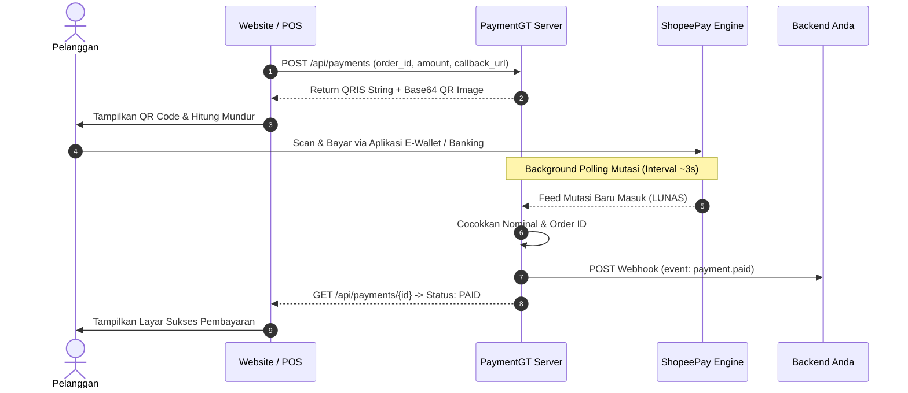

<div align="center">

# ⚡ PaymentGT

**Gateway QRIS Dinamis & Real-time Settlement Daemon untuk ShopeePay Merchant**

[](https://golang.org)
[](LICENSE)
[](#)
[](#)

*Ubah QRIS Statis outlet ShopeePay menjadi QRIS Dinamis instan dengan nominal pas (tanpa kode unik acak), settlement otomatis, dan webhook HTTP ke backend Anda.*

</div>

---

## 📌 Mengapa PaymentGT?

Umumnya, QRIS statis di toko fisik mengharuskan pelanggan mengetik sendiri nominal pembayaran saat scan. Hal ini rawan salah transfer atau kecurangan.

**PaymentGT** menjembatani QRIS cetak ShopeePay Anda dengan sistem aplikasi digital:
1. **Nominal Pas / Murni**: Menghasilkan payload EMVCo QRIS dinamis dengan tag amount (Tag 54) yang terkunci persis sesuai tagihan (contoh: Rp 50.000 tetap Rp 50.000).
2. **Settlement Real-time**: Memonitor mutasi masuk langsung dari API ShopeePay Partner/Merchant secara kontinyu.
3. **Notifikasi Webhook**: Ketika dana masuk terverifikasi, daemon secara otomatis mengirim HTTP POST webhook ke endpoint server Anda (dilengkapi retry otomatis 3x).
4. **Ringan & Cepat**: Ditulis dalam Go murni dengan konsumsi RAM minimal (< 30 MB) dan latensi respon REST API di bawah 10ms.

---

## 📁 Struktur Direktori

```
.
├── cmd/
│   ├── server/       # HTTP REST API server & webhook daemon
│   ├── gateway/      # CLI generator & terminal QR viewer
│   └── login/        # CLI interaktif login OTP ShopeePay Merchant
├── core/             # Tipe domain, status pembayaran, error handling
├── payment/          # Payment service, allocation manager, mutation matcher
├── qris/             # Parser & builder EMVCo QRIS, CRC16 checksum
├── shopee/           # Provider ShopeePay Partner/Merchant (Production-ready)
├── gopay/            # Provider GoPay/GoBiz (GoID OAuth2 & settlement feed)
├── utils/            # Logger, formatting helper, ID generator
├── session.example.json # Template konfigurasi session merchant
├── go.mod
└── README.md
```

---

## 🔄 Alur Transaksi (Transaction Flow)



---

## 🚀 Panduan Memulai (Quick Start)

### 1. Dapatkan Sesi Merchant ShopeePay

Karena portal Shopee Partner menggunakan sistem proteksi browser, cara paling stabil dan direkomendasikan adalah menyalin cookie sesi langsung dari browser:

1. Buka browser dan login ke portal [Shopee Partner](https://partner.shopee.co.id/).
2. Buka **Developer Tools** (tekan `F12` atau klik kanan > **Inspect**).
3. Buka tab **Application** (atau **Storage**) > **Cookies** > pilih domain `shopee.co.id`.
4. Salin file template contoh:
   ```bash
   cp session.example.json session.json
   ```
5. Buka `session.json` dan isi nilai cookie penting berikut:
   - `SPC_F`, `SPC_SEC_SI`, `SPC_T_ID`, `SPC_T_IV`, `SPC_U`
   - Masukkan `merchant.id` dan `storeId` outlet Anda (bisa dilihat dari request API di tab Network).

> 💡 **Info**: File `session.json` sudah masuk ke `.gitignore` sehingga aman dan tidak akan ter-commit ke Git.

### 2. Siapkan String QRIS Statis

Ambil string payload QRIS statis outlet Anda. String ini diawali dengan `000201010211...` dan dapat diperoleh dengan cara:
- Memindai (scan) gambar QRIS cetak Anda dengan aplikasi scanner teks QR biasa, atau
- Mengunduh QR dari portal Shopee Partner.

### 3. Jalankan Server

Jalankan server menggunakan flag CLI:
```bash
go run ./cmd/server -port 8080 -qris "0002010102112661..."
```

Atau gunakan environment variable (cocok untuk deployment Docker / Systemd):
```bash
export STATIC_QRIS="0002010102112661..."
go run ./cmd/server -port 8080
```

Output log saat berhasil berjalan:
```
[INFO] 🚀 QRIS Gateway Server berjalan di port :8080
[INFO] 📌 Merchant: NAMA_TOKO_ANDA | Store ID: 12345678
[INFO] 📡 Polling mutasi ShopeePay aktif...
```

---

## 📡 REST API Reference

### 1. Cek Kesehatan Server (Health Check)
Memeriksa apakah server aktif dan sesi merchant masih terhubung.

```http
GET /health
```

**Contoh Request**:
```bash
curl -X GET http://localhost:8080/health
```

**Response (200 OK)**:
```json
{
  "status": "healthy",
  "store_id": "23677133",
  "merchant": "TOKO KITA MAKMUR",
  "timestamp": "2026-09-22T08:00:00Z"
}
```

---

### 2. Buat Tagihan QRIS Baru
Membuat QRIS dinamis unik yang nominalnya terkunci persis sesuai parameter `amount`.

```http
POST /api/payments
Content-Type: application/json
```

**Contoh Request**:
```bash
curl -X POST http://localhost:8080/api/payments \
  -H "Content-Type: application/json" \
  -d '{
    "order_id": "INV-20260922-001",
    "amount": 15000,
    "expires_in_minutes": 10,
    "callback_url": "https://backend-anda.com/api/webhook/qris"
  }'
```

**Response (200 OK)**:
```json
{
  "success": true,
  "payment_id": "pay_a9f1b2c3d4e5",
  "order_id": "INV-20260922-001",
  "amount": 15000,
  "unique_amount": 15000,
  "unique_offset": 0,
  "status": "PENDING",
  "qris_string": "00020101021226...5405150005802ID...6304A1B2",
  "qris_image_base64": "data:image/png;base64,iVBORw0KGgoAAAANSUhEUgAA...",
  "expires_at": "2026-09-22T08:10:00Z",
  "created_at": "2026-09-22T08:00:00Z"
}
```

> 🎯 **Frontend Tip**: Anda bisa langsung merender `qris_image_base64` ke tag `` di HTML/React/Next.js tanpa perlu library QR generator tambahan.

---

### 3. Cek Status Pembayaran
Digunakan oleh frontend untuk polling status jika tidak menggunakan webhook langsung ke frontend.

```http
GET /api/payments/{payment_id}
```

**Contoh Request**:
```bash
curl -X GET http://localhost:8080/api/payments/pay_a9f1b2c3d4e5
```

**Response Saat Lunas (200 OK)**:
```json
{
  "success": true,
  "payment_id": "pay_a9f1b2c3d4e5",
  "order_id": "INV-20260922-001",
  "unique_amount": 15000,
  "status": "PAID",
  "expires_at": "2026-09-22T08:10:00Z",
  "paid_at": "2026-09-22T08:03:12Z",
  "transaction_id": "TRX-SHOPEE-99881122",
  "payment_type": "SHOPEEPAY"
}
```

---

### 4. Notifikasi Webhook (Callback)

Ketika transaksi berhasil diselesaikan oleh pembeli, PaymentGT akan mengirim HTTP `POST` ke `callback_url` yang didaftarkan saat pembuatan pembayaran.

**Header HTTP**:
```http
POST /api/webhook/qris HTTP/1.1
Host: backend-anda.com
Content-Type: application/json
User-Agent: QRISPaymentGateway/1.0
```

**Body JSON**:
```json
{
  "event": "payment.paid",
  "payment_id": "pay_a9f1b2c3d4e5",
  "order_id": "INV-20260922-001",
  "amount": 15000,
  "status": "PAID",
  "transaction_id": "TRX-SHOPEE-99881122",
  "paid_at": "2026-09-22T08:03:12Z"
}
```

> 🔁 **Kebijakan Retry**: Jika endpoint webhook Anda merespons dengan HTTP status selain `2xx`, PaymentGT akan mencoba mengirim ulang hingga 3 kali. Endpoint Anda cukup merespons `200 OK`.

---

## 🛠️ Contoh Integrasi Backend

### Node.js / Express Webhook Handler
```javascript
import express from 'express';
const app = express();
app.use(express.json());

app.post('/api/webhook/qris', (req, res) => {
  const { event, order_id, amount, status, transaction_id } = req.body;

  if (event === 'payment.paid' && status === 'PAID') {
    console.log(`✅ Order ${order_id} lunas! Nominal: Rp ${amount} (Ref: ${transaction_id})`);
    // Eksekusi logic bisnis (aktivasi layanan, update pesanan di DB, dsb.)
  }

  res.status(200).json({ received: true });
});

app.listen(3000, () => console.log('Webhook server ready on :3000'));
```

### PHP / Laravel Webhook Handler
```php
public function handleWebhook(Request $request)
{
    $event   = $request->input('event');
    $orderId = $request->input('order_id');
    $status  = $request->input('status');

    if ($event === 'payment.paid' && $status === 'PAID') {
        Order::where('id', $orderId)->update(['status' => 'paid']);
        return response()->json(['success' => true]);
    }

    return response()->json(['ignored' => true]);
}
```

---

## ⚙️ Parameter CLI & Environment Variables

| Parameter CLI | Environment Variable | Default | Keterangan |
|---|---|---|---|
| `-port` | `PORT` | `8080` | Port listen server HTTP |
| `-session` | `SESSION_PATH` | `session.json` | Path ke file konfigurasi sesi merchant |
| `-qris` | `STATIC_QRIS` | *(wajib)* | String QRIS statis outlet ShopeePay |

---

## 🚢 Deployment Production

### Opsi A — Systemd Service (Ubuntu / Debian)

1. Buat binary executable:
   ```bash
   go build -o /opt/paymentgt/server ./cmd/server
   ```
2. Buat file service `/etc/systemd/system/paymentgt.service`:
   ```ini
   [Unit]
   Description=PaymentGT ShopeePay QRIS Gateway
   After=network.target

   [Service]
   Type=simple
   User=www-data
   WorkingDirectory=/opt/paymentgt
   Environment="STATIC_QRIS=0002010102112661..."
   ExecStart=/opt/paymentgt/server -port 8080 -session /opt/paymentgt/session.json
   Restart=always
   RestartSec=5

   [Install]
   WantedBy=multi-user.target
   ```
3. Aktifkan dan jalankan:
   ```bash
   sudo systemctl daemon-reload
   sudo systemctl enable --now paymentgt
   sudo systemctl status paymentgt
   ```

### Opsi B — Nginx Reverse Proxy (SSL HTTPS)

```nginx
server {
    listen 80;
    server_name qris.domainanda.com;
    return 301 https://$host$request_uri;
}

server {
    listen 443 ssl http2;
    server_name qris.domainanda.com;

    ssl_certificate /etc/letsencrypt/live/qris.domainanda.com/fullchain.pem;
    ssl_certificate_key /etc/letsencrypt/live/qris.domainanda.com/privkey.pem;

    location / {
        proxy_pass http://127.0.0.1:8080;
        proxy_set_header Host $host;
        proxy_set_header X-Real-IP $remote_addr;
        proxy_set_header X-Forwarded-For $proxy_add_x_forwarded_for;
    }
}
```

---

## 🔒 Keamanan & Praktik Terbaik

- **Jangan Commit session.json**: Selalu pastikan file `session.json` dan `.env` masuk ke `.gitignore`.
- **Gunakan Reverse Proxy**: Jalankan di belakang Nginx/Caddy dengan HTTPS/TLS untuk melindungi transmisi payload REST API.
- **Firewall**: Batasi akses port server internal (misal port 8080) agar hanya bisa dijangkau oleh server backend atau reverse proxy Anda.

---

## 📄 Lisensi

Didistribusikan di bawah lisensi [MIT](LICENSE). Bebas digunakan untuk keperluan komersial maupun non-komersial.